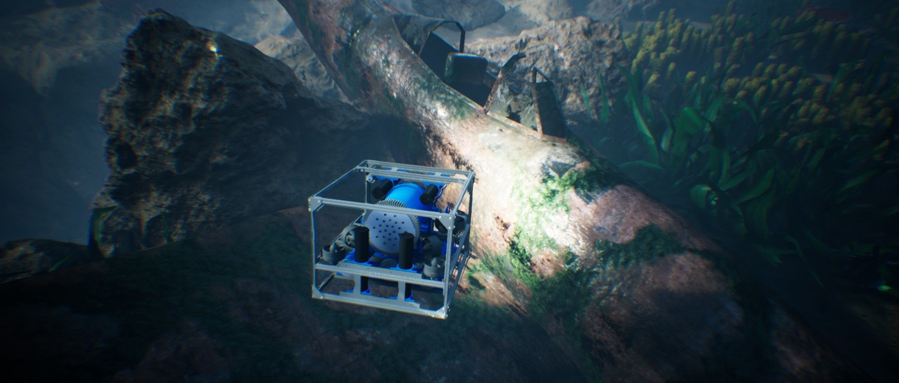

# HoloOcean



HoloOcean has moved to Github. Click [here to go to the documentation](https://byu-holoocean.github.io/holoocean-docs/)

The documentation installation page has instructions for accessing the repo.


HoloOcean is a high-fidelity simulator for underwater robotics built on top of Unreal Engine 4, and forked from Holodeck by BYU's PCCL Lab.

If you use HoloOcean for your research, please cite our ICRA publication;

```
@inproceedings{Potokar22icra,
  author = {E. Potokar and S. Ashford and M. Kaess and J. Mangelson},
  title = {Holo{O}cean: An Underwater Robotics Simulator},
  booktitle = {Proc. IEEE Intl. Conf. on Robotics and Automation, ICRA},
  address = {Philadelphia, PA, USA},
  month = may,
  year = {2022}
}
```
